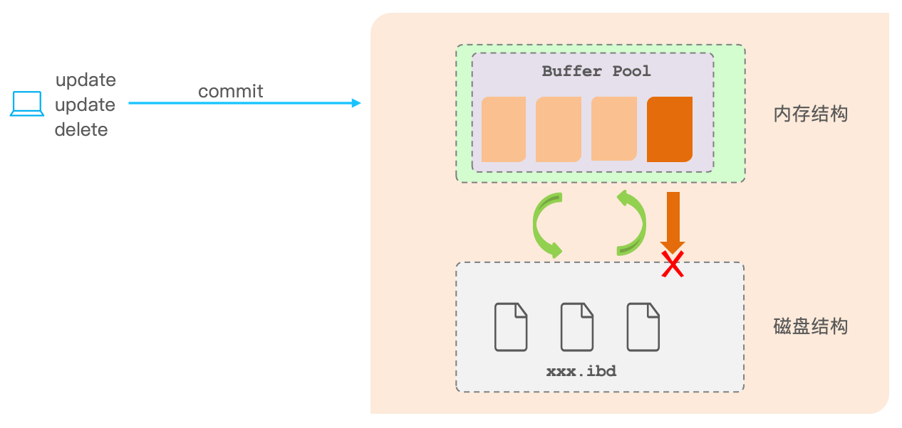
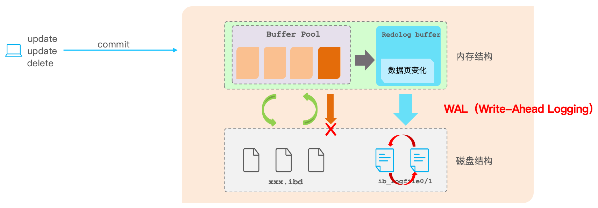
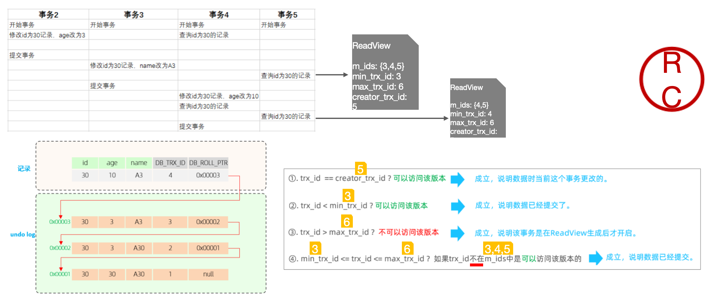

# mysql事务
## 1. 能说一说mysql事务吗？
事务是一组操作的集合，它是一个不可分割的工作单位，事务会把所有的操作作为一个整体一起向系统提交或撤销操作请求，即这些操作要么同时成功，要么同时失败。

事务具有ACID四个特性：
- 原子性（Atomicity）：事务是不可分割的最小操作单元，要么全部成功，要么全部失败。
- 一致性（Consistency）：事务完成时，必须使所有的数据都保持一致状态。
- 隔离性（Isolation）：数据库系统提供的隔离机制，保证事务在不受外部并发操作影响的独立环境下运行。
- 持久性（Durability）：事务一旦提交或回滚，它对数据库中的数据的改变就是永久的。
> 例如，A向B转账500元，这个操作要么都成功，要么都失败，体现了原子性。转账过程中数据要保持一致，A扣除了500元，B必须增加500元。隔离性体现在A向B转账时，不受其他事务干扰。持久性体现在事务提交后，数据要被持久化存储。

## 2. 并发事务会带来哪些问题？怎么解决这些问题？
并发事务问题：

| 类型 | 含义   |
|----|------|
| 脏读 | 一个事务读到另外一个事务还没有提交的数据 |
| 不可重复读 | 一个事务先后读取同一条记录，但两次读取的数据不同 |     
| 幻读 | 一个事务按照条件查询数据时，没有对应的数据行，但是在插入数据时，又发现这行数据已经存在，好像出现了”幻影” |

解决这些问题的方法是对事务进行隔离

| 隔离级别 | 脏读 | 不可重复读 | 幻读 |
|--------|------|-------|------|
| Read uncommitted 未提交读 | √ | √ | √ |
| Read committed 已提交读 | × | √ | √ |
| Repeatable read(默认) 可重复读 | × | × | √ |
| Serializable 可串行化 | × | × | × |
⚠️事务隔离级别越高，数据越安全，但是性能越低。

## 3. undo log和redo log的区别？
- **缓冲池（buffer pool）**:主内存中的一个区域，里面可以缓存磁盘上经常操作的真实数据，在执行增删改查操作时，先操作缓冲池中的数据（若缓冲池没有数据，则从磁盘加载并缓存），以一定频率刷新到磁盘，从而减少磁盘IO，加快处理速度
- **数据页（page）**:是InnoDB 存储引擎磁盘管理的最小单元，每个页的大小默认为 16KB。页中存储的是行数据

### 3.1 redo log
重做日志，记录的是事务提交时数据页的物理修改，是用来实现事务的持久性。

该日志文件由两部分组成：重做日志缓冲（redo log buffer）以及重做日志文件（redo log file）,前者是在内存中，后者在磁盘中。当事务提交之后会把所有修改信息都存到该日志文件中, 用于在刷新脏页到磁盘,发生错误时, 进行数据恢复使用。

### 3.2 undo log
回滚日志，用于记录数据被修改前的信息 , 作用包含两个 : 提供回滚 和 MVCC(多版本并发控制) 。undo log和redo log记录物理日志不一样，它是逻辑日志。
- 可以认为当delete一条记录时，undo log中会记录一条对应的insert记录，反之亦然，
- 当update一条记录时，它记录一条对应相反的update记录。当执行rollback时，就可以从undo log中的逻辑记录读取到相应的内容并进行回滚。

undo log可以实现事务的一致性和原子性

### 3.3 小结
- redo log: 记录的是数据页的物理变化，服务宕机可用来同步数据
- undo log ：记录的是逻辑日志，当事务回滚时，通过逆操作恢复原来的数据
- redo log保证了事务的持久性，undo log保证了事务的原子性和一致性

## 4. 那事务中的隔离性是如何保证的？
事务的隔离性通过锁和多版本并发控制（MVCC）来保证。MVCC通过维护数据的多个版本来避免读写冲突。底层实现包括隐藏字段、undo log和read view。隐藏字段包括trx_id和roll_pointer。undo log记录了不同版本的数据，通过roll_pointer形成版本链。read view定义了不同隔离级别下的快照读，决定了事务访问哪个版本的数据
### 4.1 MVCC
全称 Multi-Version Concurrency Control，多版本并发控制。指维护一个数据的多个版本，使得读写操作没有冲突
MVCC的具体实现，主要依赖于数据库记录中的隐式字段、undo log日志、readView。
- 隐式字段

| 隐藏字段 | 含义  |
|--------|-----|
|DB_TRX_ID|最近修改事务ID，记录插入这条记录或最后一次修改该记录的事务ID。|
|DB_ROLL_PTR|回滚指针，指向这条记录的上一个版本，用于配合undo log，指向上一个版本。|
|DB_ROW_ID|隐藏主键，如果表结构没有指定主键，将会生成该隐藏字段。|

- undo log 
  - 回滚日志，在insert、update、delete的时候产生的便于数据回滚的日志。
  - 当insert的时候，产生的undo log日志只在回滚时需要，在事务提交后，可被立即删除。
  - 而update、delete的时候，产生的undo log日志不仅在回滚时需要，mvcc版本访问也需要，不会立即被删除。

- undo log 版本链

  > 不同事务或相同事务对同一条记录进行修改，会导致该记录的undolog生成一条记录版本链表，链表的头部是最新的旧记录，链表尾部是最早的旧记录。
 
- ReadView

  | 字段 | 含义  |
  |------|-----|
  |m_ids|前活跃的事务ID集合|
  |min_trx_id|最小活跃事务ID|
  |max_trx_id|预分配事务ID，当前最大事务ID+1（因为事务ID是自增的）|
  |creator_trx_id|ReadView创建者的事务ID|
  
  **版本链数据访问规则**
  
  trx_id：代表是当前事务ID

  | 条件 | 访问情况 | 说明 |
  |----|------|----|
  |trx_id  == creator_trx_id|可以访问该版本|成立，说明数据是当前这个事务更改的|
  |trx_id < min_trx_id|可以访问该版本|成立，说明数据已经提交了。|
  |trx_id > max_trx_id|不可以访问该版本|成立，说明该事务是在ReadView生成后才开启。|
  |min_trx_id <= trx_id <= max_trx_id|如果trx_id不在m_ids中是可以访问该版本的|成立，说明数据已经提交。|

  不同的隔离级别，生成ReadView的时机不同：
  - READ COMMITTED ：在事务中每一次执行快照读时生成ReadView。
  - REPEATABLE READ：仅在事务中第一次执行快照读时生成ReadView，后续复用该ReadView。

  

