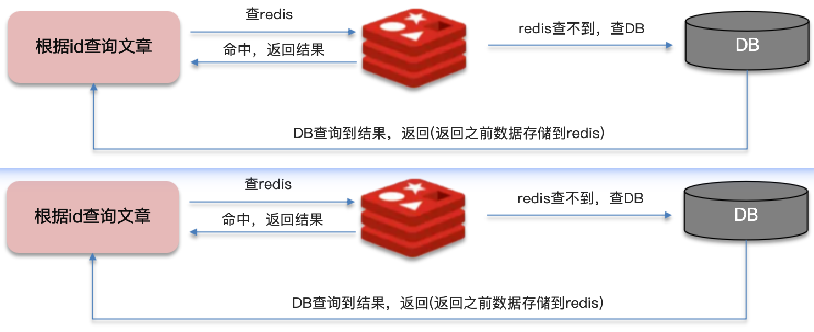
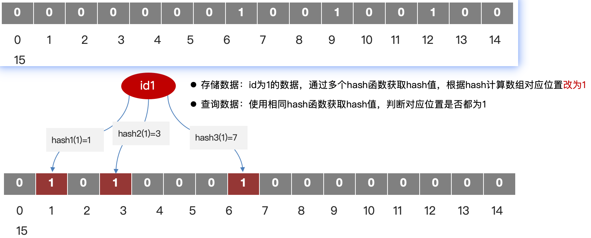
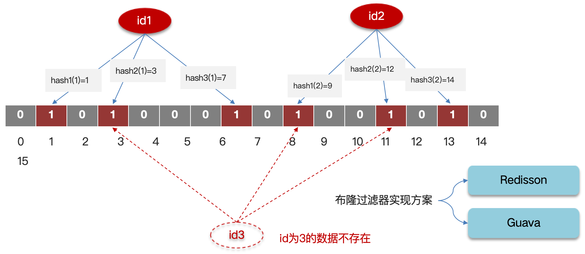

# Redis 使用场景
此部分面试题一般会结合项目来问，回答时要将知识点融入到项目场景中

## 1. 我看你做的项目中都用到了Redis，你都在哪些场景下用到了Redis？
> Tips：此问题目的一是验证你项目的真实性，二是作为深入提问的切入点
- 缓存（缓存三兄弟（穿透、击穿、雪崩）、双写一致、持久化、数据过期策略，数据淘汰策略）
- 分布式锁（setnx、redisson ）
- 消息队列、延迟队列（何种数据类型，如何实现）
- 分布式计数器（计数器类型，如何实现）

## 2. 什么是缓存穿透？怎么解决？
- 缓存穿透：查询一个不存在的数据，缓存和数据库中都没有此数据，就会导致每次请求都查数据库
  
- 解决方案一：缓存空数据
- 解决方案二：布隆过滤器
  - 布隆过滤器主要用于检索一个数据是否在一个集合中，我们当时使用的是Redisson实现的布隆过滤器。
  - 它的底层主要是先去初始化一个比较大的数组，里面存放的二进制0和1。一开始都是0，当一个key来了之后，经过三次hash计算，模数组长度找到找到对应下标，然后将该位置改为1，这三个位置的1表明key存在。
  
  
  
  - 优点：内存占用较少，没有多余key
  - 缺点：实现复杂，存在误判
    - 会产生误判，设置一个误判率，比如%5。
    - 数组越小误判率就越大，数组越大误判率就越小，但是同时带来了更多的内存消耗。

## 3. 什么是缓存击穿？怎么解决？
- 缓存击穿：给某一个key设置了过期时间，当key过期的时候，恰好这时间点对这个key有大量的并发请求过来，这些并发的请求可能会瞬间把DB压垮

- 解决方案一：互斥锁
- 解决方案二：逻辑过期

> Tips：回答示例
> 1. 缓存击穿的意思是对于设置了过期时间的key，缓存在某个时间点过期的时候，恰好这个时间点对这个key有大量的并发请求过来，这些请求发现这个key的缓存已经过期，就都会从数据库查询数据并同时缓存到Redis中，这个时候大并发请求可能会瞬间把DB压垮。
> 2. 解决方案有两种方式：
> + 第一种方案可以使用互斥锁，当缓存失效时，不立即去从DB中查询数据，而是先使用如Redis的setnx去设置一个互斥锁，当操作成功后返回时再从DB中查询数据并回设缓存，否则就重试get缓存的操作。
> + 第二种方案可以设置当前key逻辑过期，在设置key的时候，设置一个过期时间字段一块存入缓存中，不给当前key设置过期时间；当查询的时候，从redis取出数据后判断时间是否过期；如果过期则在另一个线程进行数据同步，当前线程正常返回数据，此数据不是最新的
> 3. 这两种方案各有利弊，如果选择数据的强一致性，建议使用分布式锁的方案，性能上可能会有影响；如果优先考虑高可用性，可以选择key的逻辑删除，性能比较高，但是数据会存在一定的延迟。

## 4. 什么是缓存雪崩？怎么解决？
- 缓存雪崩：在同一时段大量的缓存key同时失效或者Redis服务宕机，导致大量请求到达数据库，带来巨大压力

- 解决方案：
  - 给不同的key的TTL添加随机值
  - 利用Redis集群提高服务的可用性（哨兵模式、集群模式）
  - 给缓存业务添加降级限流策略，降级可做为系统的保底策略，适用于穿透、击穿、雪崩
    （nginx、spring cloud gateway、sentinel）
  - 给业务添加多级缓存（Guava/Caffeine Cache、LocalCache、RedisCache）
> Tips：回答示例
> 1. 缓存雪崩的意思是设置缓存时采用了相同的过期时间，导致缓存在某一时间同时失效，请求全部转发到了数据库，数据库瞬时压力过大雪崩。与缓存击穿的区别：雪崩是很多个key，击穿是某一个key。
> 2. 解决方案主要是将缓存失效时间分散开，比如可以在原有的失效时间基础上增加一个随机值，比如1-5分钟间的随便值，这样每一个缓存的过期时间的重复率就会降低，很难引发一起失效的情况。

**《缓存三兄弟》**

穿透无中生有key，布隆过滤null隔离。

缓存击穿过期key，锁与非期解难题。

雪崩大量过期key，过期时间要随机。

面试必考三兄弟，可用限流来保底。

## 5. redis做为缓存，DB的数据如何与redis进行同步呢？（双写一致性）
### 5.1 分布式锁保证数据一致性
- 双写一致性：当修改了数据库的数据也要同时更新缓存的数据，缓存和数据库的数据要保持一致
- 读操作：缓存命中，直接返回；缓存未命中查询数据库，写入缓存设置超时时间，然后返回结果

- 写操作：延迟双删

- 双写一致分布式锁

- 读多写少
  - 共享锁：读锁readLock，加锁之后，其它线程可以共享读操作
  - 排他锁：独占锁writeLock，加锁之后，阻塞其它线程读写操作

```java
public Item getById(Integer id) {
    RReadWriteLock readWriteLock = redissonClient.getReadWriteLock("ITEM_READ_WRITE_LOCK");
    // 读之前加读锁，读锁的作用就是等待该lockkey释放写锁以后再读
    RLock readLock = readWriteLock.readLock();
    try {
        // 加读锁
        readLock.lock();
        System.out.println("readLock...");
        Item item = (Item) redisTemplate.opsForValue().get("item:" + id);
        if (item != null) {
            return item;
        }
        // 查询业务数据
        item = new Item(id, "苹果手机", "苹果手机", 6999.00);
        // 写入缓存
        redisTemplate.opsForValue().set("item:" + id, item);
        // 返回数据
        return item;
    } finally {
        // 解锁
        readLock.unlock();
    }
}
```
```java
public void updateById(Integer id) {
    RReadWriteLock readWriteLock = redissonClient.getReadWriteLock("ITEM_READ_WRITE_LOCK");
    // 写之前加写锁，写锁加锁成功，读锁只能等待
    RLock writeLock = readWriteLock.writeLock();
    try {
        // 加写锁
        writeLock.lock();
        System.out.println("writeLock...");
        // 更新业务数据
        Item item = new Item(id, "苹果手机", "苹果手机", 6888.00);
        try {
            Thread.sleep(10000);
        } catch (InterruptedException e) {
            e.printStackTrace();
        }
        // 删除缓存
        redisTemplate.delete("item:" + id);
    } finally {
        // 解锁
        writeLock.unlock();
    }
}
```
### 5.2 异步通知保证数据的最终一致性

- 基于Canal的异步通知

> Tip：二进制日志（BINLOG）记录了所有的 DDL（数据定义语言）语句和 DML（数据操纵语言）语句，但不包括数据查询（SELECT、SHOW）语句。

