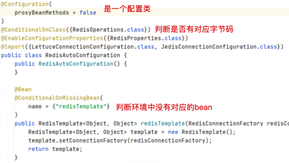

# SpringBoot基础
## 1. SpringBoot简介
SpringBoot是一个快速开发框架，它提供了一系列的starter，通过starter可以快速引入各种依赖，简化开发。

## 2. SpringBoot自动配置原理
> Springboot中最高频的一道面试题，也是框架最核心的思想

- <font color="red">@SpringBootConfiguration</font>：该注解与 @Configuration 注解作用相同，用来声明当前也是一个配置类。
- <font color="red">@ComponentScan</font>：组件扫描，默认扫描当前引导类所在包及其子包。
- <font color="red">@EnableAutoConfiguration</font>：SpringBoot实现自动化配置的核心注解。




> 1,  在Spring Boot项目中的引导类上有一个注解@SpringBootApplication，这个注解是对三个注解进行了封装，分别是：
> - @SpringBootConfiguration
> - @EnableAutoConfiguration
> - @ComponentScan
> 
> 2,  其中@EnableAutoConfiguration是实现自动化配置的核心注解。 该注解通过@Import注解导入对应的配置选择器。
内部就是读取了该项目和该项目引用的Jar包的的classpath路径下META-INF/spring.factories文件中的所配置的类的全类名。 在这些配置类中所定义的Bean会根据条件注解所指定的条件来决定是否需要将其导入到Spring容器中。
> 
> 3, 条件判断会有像@ConditionalOnClass这样的注解，判断是否有对应的class文件，如果有则加载该类，把这个配置类的所有的Bean放入spring容器中使用。

## 3. SpringBoot的启动流程是怎么样的？
### 3.1 SpringBoot启动的流程总览
每一个SpringBoot程序都有一个主入口，这个主入口就是main方法，而main方法中都会调用 SpringBootApplication.run 方法，查看该方法的源码可以发现启动流程主要分为两个阶段：
- 初始化SpringApplication
- 运行SpringApplication的过程
  - SpringApplicationRunListeners 引用启动监控模块
  - ConfigrableEnvironment配置环境模块和监听：包括创建配置环境、加载属性配置文件和配置监听
  - ConfigrableApplicationContext配置应用上下文：包括配置应用上下文对象、配置基本属性和刷新应用上下文

### 3.2 初始化SpringApplication
SpringApplication的初始化，**配置基本的环境变量、资源、构造器、监听器**，初始化阶段的主要作用是为运行SpringApplication实例对象启动环境变量准备以及进行必要的资源构造器的初始化动作
主要代码如下：
```java
public SpringApplication(ResourceLoader resourceLoader, Object... sources){
    this.resourceLoader = resourceLoader;
    initialize(source);
}

@SupressWarnings({"unchecked","rowtypes"})
private void initialize(Object[] sources){
    if(sources != null && sources.length > 0){
        this.sources.addAll(Arrays.asList(sources));
    }
    this.WebEnvironment = deduceWebEnvironment;
    setInitiallizers((Collection) getSpringFactoriesInstances(ApplicationContextInitiallizer.class));
    setListeners((Collection) getSpringFactoriesInstances(ApplicationListener.class));
    this.mainApplicationClass = deduceMainApplicationClass();
}
```

### 3.3 运行SpringApplication
SpringBoot正式启动加载过程，包括**启动流程监控模块、配置环境加载模块、ApplicationContext容器上下文环境加载模块**。refreshContext方法刷新应用上下文并进行自动化配置模块加载，也就是上文提到的SpringFactoriesLoader根据指定classpath加载META-INF/spring.factories文件的配置，实现自动配置核心功能。

运行SpringApplication的主要代码如下:
```java
public ConfigurableApplicationContext run(String... args) {
    ConfigurableApplicationContext context = null;
    FailureAnalyzer analyzer = null;
    configureHeadlessProperty();
    // 步骤1
    SpringApplicationRunListeners listeners = getRunListeners(args);
        listeners.starting();
    try {
        // 步骤2
        ApplicationArguments applicationArguments = new DefaultApplicationArguments(args);
        ConfigurableEnvironment environment = prepareEnvironment(listeners, applicationArguments);
        Banner printBanner = printBanner(environment);
        // 步骤3
        context = createApplicationContext();
        prepareContext(context, environment, listeners, applicationArguments, printBanner);
        refreshContext(context);
        afterRefresh(context, applicationArguments);
        listeners.finished(context, null);
        // 省略
        return context;
    }
}
```
>（1）SpringApplciationRunListener应用启动监控模块
> 
>（2）ConfigurableEnviroment 配置环境模块和监听
> 
>（3）ConfigurableApplicationContext配置应用上下文