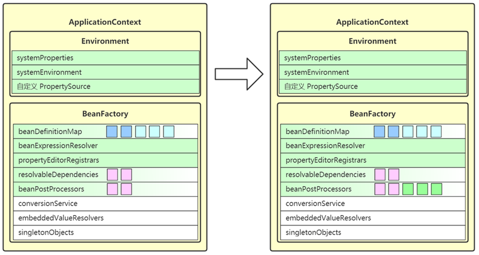
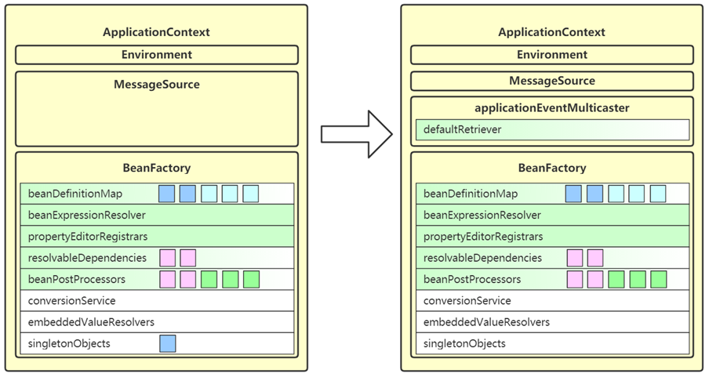

## 1. Spring refresh 流程
**要求**

* 掌握 refresh 的 12 个步骤

**Spring refresh 概述**

refresh 是 AbstractApplicationContext 中的一个方法，负责初始化 ApplicationContext 容器，容器必须调用 refresh 才能正常工作。它的内部主要会调用 12 个方法，我们把它们称为 refresh 的 12 个步骤：

1. prepareRefresh

2. obtainFreshBeanFactory

3. prepareBeanFactory

4. postProcessBeanFactory

5. invokeBeanFactoryPostProcessors

6. registerBeanPostProcessors

7. initMessageSource

8. initApplicationEventMulticaster

9. onRefresh

10. registerListeners

11. finishBeanFactoryInitialization

12. finishRefresh

> ***功能分类***
>
> * 1 为准备环境
>
> * 2 3 4 5 6 为准备 BeanFactory
>
> * 7 8 9 10 12 为准备 ApplicationContext
>
> * 11 为初始化 BeanFactory 中非延迟单例 bean

**1. prepareRefresh**

* 这一步创建和准备了 Environment 对象，它作为 ApplicationContext 的一个成员变量

* Environment 对象的作用之一是为后续 @Value，值注入时提供键值
* Environment 分成三个主要部分
    * systemProperties - 保存 java 环境键值
    * systemEnvironment - 保存系统环境键值
    * 自定义 PropertySource - 保存自定义键值，例如来自于 *.properties 文件的键值

  
**2. obtainFreshBeanFactory**

* 这一步获取（或创建） BeanFactory，它也是作为 ApplicationContext 的一个成员变量
* BeanFactory 的作用是负责 bean 的创建、依赖注入和初始化，bean 的各项特征由 BeanDefinition 定义
    * BeanDefinition 作为 bean 的设计蓝图，规定了 bean 的特征，如单例多例、依赖关系、初始销毁方法等
    * BeanDefinition 的来源有多种多样，可以是通过 xml 获得、配置类获得、组件扫描获得，也可以是编程添加
* 所有的 BeanDefinition 会存入 BeanFactory 中的 beanDefinitionMap 集合

**3. prepareBeanFactory**

* 这一步会进一步完善 BeanFactory，为它的各项成员变量赋值
* beanExpressionResolver 用来解析 SpEL，常见实现为 StandardBeanExpressionResolver
* propertyEditorRegistrars 会注册类型转换器
    * 它在这里使用了 ResourceEditorRegistrar 实现类
    * 并应用 ApplicationContext 提供的 Environment 完成 ${ } 解析
* registerResolvableDependency 来注册 beanFactory 以及 ApplicationContext，让它们也能用于依赖注入
* beanPostProcessors 是 bean 后处理器集合，会工作在 bean 的生命周期各个阶段，此处会添加两个：
    * ApplicationContextAwareProcessor 用来解析 Aware 接口
    * ApplicationListenerDetector 用来识别容器中 ApplicationListener 类型的 bean

**4. postProcessBeanFactory**

* 这一步是空实现，留给子类扩展。
    * 一般 Web 环境的 ApplicationContext 都要利用它注册新的 Scope，完善 Web 下的 BeanFactory
* 这里体现的是模板方法设计模式

**5. invokeBeanFactoryPostProcessors**

* 这一步会调用 beanFactory 后处理器
* beanFactory 后处理器，充当 beanFactory 的扩展点，可以用来补充或修改 BeanDefinition
* 常见的 beanFactory 后处理器有
    * ConfigurationClassPostProcessor – 解析 @Configuration、@Bean、@Import、@PropertySource 等
    * PropertySourcesPlaceHolderConfigurer – 替换 BeanDefinition 中的 ${ }
    * MapperScannerConfigurer – 补充 Mapper 接口对应的 BeanDefinition

**6. registerBeanPostProcessors**

* 这一步是继续从 beanFactory 中找出 bean 后处理器，添加至 beanPostProcessors 集合中
* bean 后处理器，充当 bean 的扩展点，可以工作在 bean 的实例化、依赖注入、初始化阶段，常见的有：
    * AutowiredAnnotationBeanPostProcessor 功能有：解析 @Autowired，@Value 注解
    * CommonAnnotationBeanPostProcessor 功能有：解析 @Resource，@PostConstruct，@PreDestroy
    * AnnotationAwareAspectJAutoProxyCreator 功能有：为符合切点的目标 bean 自动创建代理

**7. initMessageSource**

* 这一步是为 ApplicationContext 添加 messageSource 成员，实现国际化功能
* 去 beanFactory 内找名为 messageSource 的 bean，如果没有，则提供空的 MessageSource 实现

**8. initApplicationContextEventMulticaster**

* 这一步为 ApplicationContext 添加事件广播器成员，即 applicationContextEventMulticaster
* 它的作用是发布事件给监听器
* 去 beanFactory 找名为 applicationEventMulticaster 的 bean 作为事件广播器，若没有，会创建默认的事件广播器
* 之后就可以调用 ApplicationContext.publishEvent(事件对象) 来发布事件

**9. onRefresh**

* 这一步是空实现，留给子类扩展
    * SpringBoot 中的子类在这里准备了 WebServer，即内嵌 web 容器
* 体现的是模板方法设计模式

**10. registerListeners**

* 这一步会从多种途径找到事件监听器，并添加至 applicationEventMulticaster
* 事件监听器顾名思义，用来接收事件广播器发布的事件，有如下来源
    * 事先编程添加的
    * 来自容器中的 bean
    * 来自于 @EventListener 的解析
* 要实现事件监听器，只需要实现 ApplicationListener 接口，重写其中 onApplicationEvent(E e) 方法即可

**11. finishBeanFactoryInitialization**

* 这一步会将 beanFactory 的成员补充完毕，并初始化所有非延迟单例 bean
* conversionService 也是一套转换机制，作为对 PropertyEditor 的补充
* embeddedValueResolvers 即内嵌值解析器，用来解析 @Value 中的 ${ }，借用的是 Environment 的功能
* singletonObjects 即单例池，缓存所有单例对象
    * 对象的创建都分三个阶段，每一阶段都有不同的 bean 后处理器参与进来，扩展功能

**12. finishRefresh**

* 这一步会为 ApplicationContext 添加 lifecycleProcessor 成员，用来控制容器内需要生命周期管理的 bean
* 如果容器中有名称为 lifecycleProcessor 的 bean 就用它，否则创建默认的生命周期管理器
* 准备好生命周期管理器，就可以实现
    * 调用 context 的 start，即可触发所有实现 LifeCycle 接口 bean 的 start
    * 调用 context 的 stop，即可触发所有实现 LifeCycle 接口 bean 的 stop
* 发布 ContextRefreshed 事件，整个 refresh 执行完成

